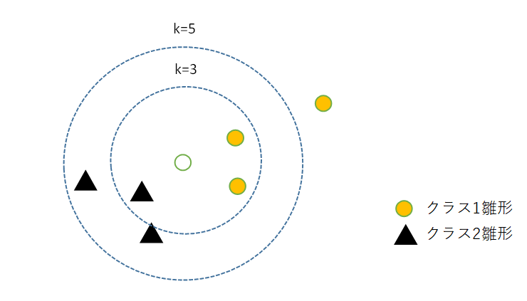

# 5.2 kNN法

最近傍の雛形をk個持ってきて、それらが最も多く所属するクラスに識別する方法をk最近傍法（kNN法）という。  

  

k=3の時クラス1、K=5の時クラス2に分類される。K=4の時は同数（タイ）になる。同数の時はリジェクトとしているが、ランダムにクラスを決める規則でも良い。  

## kNNの識別規則
 $ \{k_j} = max \{ k_1, \cdots, k_K \} $ の時jと識別する。  

